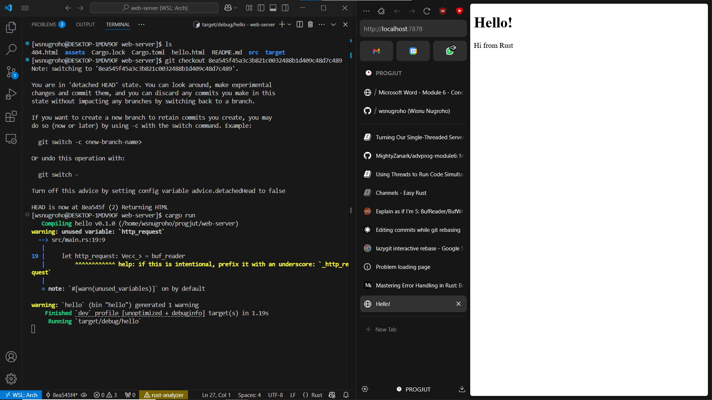
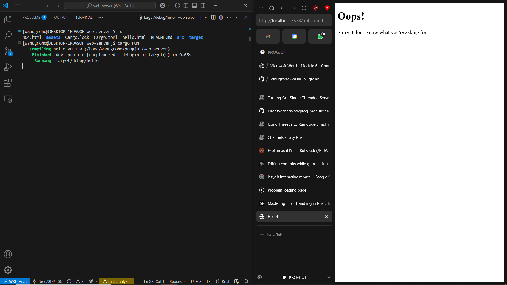

# Module 6 - Concurrency

- [Commit 1](#commit-1-reflection)
- [Commit 2](#commit-2-reflection)
- [Commit 3](#commit-3-reflection)
- [Commit 4](#commit-4-reflection)
- [Commit 5](#commit-5-reflection)
- [Commit Bonus](#commit-bonus-reflection)

## Commit 1 Reflection
Kode ini merupakan implementasi web server sederhana menggunakan Rust. Pada fungsi main server akan me-listen untuk koneksi TCP pada alamat 120.0.0.1 dan port 7878 menggunakan `TcpListener`. Kita akan melakukan unwrap pada `TcpListener` untuk mendapatkan mendapatkan hasil dari `TcpListener` atau program akan panic jika binding koneksi mengalami kegagalan. Setelah itu, program akan menerima setiap request yang masuk pada `127.0.0.1:7878`. Setiap request menghasilkan sebuah `TcpStream` yang selanjutnya akan diproses oleh fungsi `handle_connection()`. Pada fungsi `handle_connection()`, awalnya data akan dibaca dari stream menggunakan `BufReader`. `HttpRequest` akan dibaca per baris hingga menemui baris kosong (akhir header HTTP), hasil bacaanya akan dikumpulkan dalam sebuah `Vector`. Langkah terakhir yang dilakukan adalah mencetak `HttpRequest` yang telah dibaca ke konsol.

## Commit 2 Reflection 
Fungsi `handle_connection()` dimodifikasi agar dapat mengembalikan respon berupa sebuah file html dengan http response status 200OK. Pertama, perlu menggunakan modul `fs` untuk dapat membaca file html yang akan dikembalikan ke user. Setelah itu, kita akan mengembalikan response dengan header yang sesuai agar file tersebut dapat dirender di browser, alih-alih hanya menampilkan teksnya saja. Http Response akan mengembalikan sebuah status, content length dari file, dan body berupa isi file html tersebut. Response akan dikirim ke klien dengan cara menulis byte-byte response ke `TCPStream` yang sedang diproses.

## Commit 3 Reflection
Fungsi `handle_connection()` dimodifikasi kembali, kali ini bertujuan untuk melakukan routing sederhana. Routing kali ini dilakukan dengan mencocokkan url yang direquestkan dengan resource yang akan dikembalikan dalam response. Dalam hal ini, request dengan request line berupa "GET / HTTP/1.1" akan mengembalikan response berupa HTTP 200OK status dan file hello.html, sedangkan untuk request line yang lain response yang akan dikembalikan berupa HTTP 404 Not Found status dan file 404.html.

## Commit 4 Reflection
Fungsi `handle_connection()` dimodifikasi lagi agar dapat mensimulasikan request yang lambat. Apabila ada request ke path `/sleep` maka response dari request tersebut akan dikembalikan 10 detik kemudian setelah request dibuat. Hal ini dapat menyebabkan apabila ada beberapa orang yang melakukan request secara bersamaan dan salah satu orangnya request ke `/sleep` maka request yang terjadi setelah seseorang tersebut juga harus menunggu selama 10 detik juga. Hal ini disebabkan aplikasi rust kita masih memproses requestnya secara single threaded sehingga 2 atau lebih request tidak dapat diproses secara bersamaan.

## Commit 5 Reflection
Fungsi `handle_connection()` kali ini sudah dapat berjalan dengan concurrent dengan bantuan struct `ThreadPool`. Struct `ThreadPool` akan membantu dalam manajemen thread dengan fields `Worker` dan `Sender` ketika ada request. `Sender` digunakan untuk mengirimkan `Job` pada sebuah `Worker`untuk dapat dikerjakan. Pada struct `ThreadPool` ada fungsi execute yang digunakan menerima fungsi lalu mengirimkannya ke `Sender`, `Sender` selanjutnya akan mengirim fungsi tersebut ke `Worker` sebagai sebuah job. Setiap `Worker` memiliki sebuah `Reciever` yang saling bersesuian dengan sebuah `Sender` untuk menerima sebuah `Job`. `Reciever` ini diwrap menggunakan `Arc` dan `Mutex` sehingga `Receiver` dapat dimiliki oleh banyak `Worker` namun hanya akan ada satu `Worker` yang menerima `Job` dari sebuah `Receiver` dalam suatu waktu. Ketika `Worker` menerima `Job`, thread yang mengeksekusi `Job` tersebut akan dikunci sehingga `Worker` ini tidak dapat menerima `Job` lain pada disaat yang sama. Setelah `Worker` mengeksekusi `Job`-nya, thread akan di-unlock sehingga dapat menerima `Job` baru yang lain. Dengan memanfaatkan hal ini, apabila ada request yang memakan waktu lama, hal tersebut tidak memblocking request lainnya (dalam hal ini ada 4 request yang dapat berjalan secara bersamaan).

## Commit Bonus Reflection
Pada fungsi build, terdapat error handling yang dapat digunakan daripada fungsi new (kalau ada error langsung panic). Fungsi build mengembalikan data dengan signature `Result<ThreadPool, PoolCreationError>`, sehingga untuk mendapatkan `ThreadPool` kita harus menggunakan error handling secara explicit seperti (ex: unwrap, etc). Dengan handle error secara explicit, program kita bisa tetap berjalan apabila terjadi error.
